# 🏛️ Codebase Archaeologist

[](https://www.python.org/)
[](https://ai.google.dev/)
[](https://langchain-ai.github.io/langgraph/)
[](https://modelcontextprotocol.io/)
[](https://opensource.org/licenses/MIT)

> **An Agentic RAG & Code Intelligence System** that mines a repository's full git history — commits, PRs, issues, reverts, and AST symbol graphs — to answer *causal* questions about code (*"Why does this exist?"*, *"What broke last time this was touched?"*, *"What PR introduced this bug?"*), exposed live via the **Model Context Protocol (MCP)** server for Claude Desktop, Cursor, and IDE assistants.

---

## 📌 Table of Contents

- [Overview](#-overview)
- [Key Features](#-key-features)
- [Architecture & Workflow](#-architecture--workflow)
- [Real-World Benchmark Results](#-real-world-benchmark-results)
- [Quickstart Guide](#-quickstart-guide)
- [MCP Server Setup (Claude Desktop / Cursor)](#-mcp-server-setup)
- [CLI Reference](#-cli-reference)
- [Pushing to GitHub](#-pushing-to-github)
- [License](#-license)

---

## 💡 Overview

Standard code search and RAG tools answer *"what"* questions well (*where is X defined?*, *what does function Y do?*), but fail at **"why"** questions. 

The reasoning behind software architecture is scattered across temporal commit messages, PR discussions, linked issues, and revert histories — sources that are contradictory, temporally ordered, and rarely co-located. **Codebase Archaeologist** solves this by constructing a multi-hop temporal graph and indexing Abstract Syntax Tree (AST) code symbols to trace causal lineage instantly.

---

## 🔥 Key Features

- **🤖 Agentic Causal RAG**: Multi-hop reasoning graph (built with LangGraph and Google Gemini 3.5 Flash) that decomposes complex questions, formulates targeted search plans, follows cross-linked issues/PRs, and self-verifies claims with automatic draft regeneration on retry.
- **🔑 Dynamic Multi-Key Rotation**: Built-in multi-key environment variable rotation (`GEMINI_API_KEY`, `GEMINI_API_KEY_SECONDARY`, `GOOGLE_API_KEY`) that catches `429 RESOURCE_EXHAUSTED` rate limits, rotates keys dynamically, and resumes execution seamlessly.
- **🌳 IDE-Style AST Symbol Graph**: Parses source files into Abstract Syntax Trees (AST) using Python `ast` and multi-language regex fallbacks. Maps commit line diffs directly to code abstractions (`src/auth.py::AuthService::login`).
- **⚡ Hybrid Retrieval Engine**: Reciprocal Rank Fusion (RRF) combining dense vector embeddings (Qdrant) with regex-tokenized sparse keyword matching (`rank-bm25`) and SQLite metadata filters.
- **🔗 Bidirectional Cross-Link Traversal**: Automatically links commit SHAs, PR numbers (`pr#123`), and issue numbers (`issue#456`) bidirectionally during ingestion and traverses them during multi-hop graph retrieval.
- **📊 Structural Repository Intelligence**:
  - `hotspots`: Identifies files with the highest historical commit frequency.
  - `ownership`: Calculates author percentage distribution and flags High Bus Factor Risk.
  - `coupling`: Discovers file pairs that change together (temporal co-commit analysis).
  - `symbols`: Ranks AST code symbols by historical modification counts.
- **🔌 Model Context Protocol (MCP) Support**: Exposes all tools over standard `stdio` JSON-RPC transport for live querying inside Claude Desktop, Cursor, and VS Code.
- **🛡️ Production Hardening**: Thread-safe API rate throttling, `BoundedSemaphore` concurrency control, automatic Gemini model tier fallback (`gemini-3.5-flash` → `gemini-3.5-flash-lite` → `gemini-2.5-flash`), SQL wildcard escaping (`_escape_like`), and strict hex SHA regex validation.

---

## 🏗 Architecture & Workflow

```mermaid
flowchart TD
    subgraph Ingestion Pipeline
        A[Git Log & Blobs] -->|iter_commits| B[Git Parser]
        B -->|Line Mapping| C[AST Symbol Parser]
        C -->|AST Symbols| D[SQLite Metadata DB]
        A -->|Diff Text| E[Batch LLM Summarizer]
        E -->|Diff Summaries| F[Chunker]
        F --> G[BM25 Index with Regex Tokenizer]
        F --> H[Qdrant Vector Store]
        GH[GitHub REST API] -->|PRs & Issues| D
        D -->|Bidirectional Links| I[Cross-Link Engine]
    end

    subgraph LangGraph Agentic Loop
        Q[User Query] --> Decompose[Decompose Node]
        Decompose --> Plan[Plan Node]
        Plan --> Search[Hybrid RRF Search Node]
        Search --> Follow[Follow Cross-Links Node]
        Follow --> Verify[Verify Claims Node]
        Verify -->|Failed: Clear Draft| Plan
        Verify -->|Passed| Synthesize[Synthesize Response Node]
    end

    subgraph Multi-Key Resilience Layer
        KeyRot[Multi-Key Rotation Engine] -->|Rotate on 429| LLM[Google Gemini 3.5 Flash]
    end

    subgraph MCP Server Transport
        MCP[FastMCP Server] <-->|stdio JSON-RPC| Client[Claude Desktop / Cursor]
    end
```



---

## 🏆 Real-World Benchmark Results

Codebase Archaeologist has been quantitatively evaluated using an LLM-as-a-Judge evaluation harness (`eval/run_eval.py` & `eval/flask_eval.py`) across unseen major open-source repositories and complex codebases:

### Quantitative Performance Metrics

| Target Repository | Scale / Indexed Chunks | Grounded Accuracy | Citation Precision | Avg. Inference Latency |
| :--- | :---: | :---: | :---: | :---: |
| **`pallets/flask`** | **4,774 Chunks** | **98.33%** | **88.89%** | **4.2 sec / query** |
| **`codebase-archaeologist`** | **520 Chunks** | **90.00%** | **100.00%** | **3.8 sec / query** |

---

### Case Study 1: `pallets/flask` (4,774 Chunks)
- **Question**: *"How does Flask process error handling hierarchy between app-level error handlers and blueprint-level error handlers in src/flask/app.py?"*
- **Score**: **100.00% Grounded Accuracy**, **100.00% Citation Precision**
- **Discovered Mechanics**: Mapped out `app.error_handler_spec` keys (`None` for global vs. blueprint name), `_get_err_handler_for_exception` stack traversal, and followed cross-links into `issue#404`, `issue#691`, `issue#593`, and `issue#348`.

### Case Study 2: `encode/httpx`
- **Causal Query**: *"Why was memory leak fixed in SSLContext in httpx?"*
- **Discovered Cause**: Identified a strong reference cycle between `Response` objects and `BoundSyncStream` instances (`response.stream` ↔ `stream._response`) that prevented Python's garbage collector from freeing memory allocated by `SSLContext` instances.
- **Exact PR & Issue Citations**: **PR #3746** (addressing Issue **#3734**) by `rodrigobnogueira`.
- **Verified Code Fix**: Replaced strong `self._response` reference with `weakref.ref(response)`, breaking the circular reference.

### Case Study 3: `psf/requests`
- **Ingestion Throughput**: Ingested and indexed 105 commits and fitted the sparse index in **under 2 seconds**.
- **Hotspots Discovered**: Identified `.pre-commit-config.yaml` (15 commits), `pyproject.toml` (14 commits), and `src/requests/models.py` (13 commits) as primary churn hotspots.
- **Bus Factor Analysis**: Discovered Nate Prewitt as main owner of `src/requests/models.py` (46.15% contribution) with `NORMAL` bus factor risk across 6 co-authors.

---

## 🚀 Quickstart Guide

### Prerequisites

- **Python 3.11+**
- **uv** package manager (`pip install uv`)
- **Git**
- **Docker** (Optional, for persistent Qdrant server)

### 1. Clone the Repository

```bash
git clone https://github.com/avyaansharma/codebase-archaeologist.git
cd codebase-archaeologist
```

### 2. Install Dependencies

```bash
uv sync
```

### 3. Configure Environment Variables

Create a `.env` file in the project root:

```env
GEMINI_API_KEY=your_gemini_api_key_here
GITHUB_TOKEN=your_github_token_here
QDRANT_URL=http://localhost:6333
DATABASE_URL=sqlite:///./archaeologist.db
```

*(Optional: Run local Qdrant server using `docker compose up -d`)*

### 4. Ingest a Repository

```bash
# Ingest local repository with GitHub PR/Issue fetching
uv run python -m archaeologist.cli ingest . --repo-url https://github.com/owner/repo
```

### 5. Query Causal History

```bash
uv run python -m archaeologist.cli ask "Why was retry logic added to fetchUser?"
```

---

## 🔌 MCP Server Setup

Codebase Archaeologist exposes a native **Model Context Protocol (MCP)** server, allowing AI assistants like Claude Desktop or Cursor to query repository history directly.

### Claude Desktop Configuration

Add the following to your `claude_desktop_config.json`:

```json
{
  "mcpServers": {
    "codebase-archaeologist": {
      "command": "uv",
      "args": [
        "--directory",
        "C:/path/to/codebase-archaeologist",
        "run",
        "python",
        "-m",
        "archaeologist.cli",
        "start-server"
      ],
      "env": {
        "GEMINI_API_KEY": "your_gemini_api_key",
        "GITHUB_TOKEN": "your_github_token"
      }
    }
  }
}
```

---

## 🛠 CLI Reference

| Command | Description |
| :--- | :--- |
| `archaeologist ingest <path>` | Ingests commits, PRs, issues, AST symbols into DBs. |
| `archaeologist ask "<query>"` | Runs full LangGraph multi-hop agent loop over history. |
| `archaeologist hotspots` | Lists top repository hotspot files by commit frequency. |
| `archaeologist ownership` | Calculates author contribution percentages & bus factor risk. |
| `archaeologist coupling` | Finds file pairs that change together (co-commits). |
| `archaeologist symbols` | Lists extracted AST Code Symbols by commit count. |
| `archaeologist symbol-history <name>` | Retrieves all commits modifying a specific class/function. |
| `archaeologist start-server` | Starts stdio MCP Server transport. |
| `archaeologist run-eval` | Runs Grounded Accuracy evaluation benchmark. |

---

## 📤 Pushing to GitHub

To push this repository to your GitHub account (`https://github.com/avyaansharma/codebase-archaeologist`):

```bash
# Initialize git if needed
git init

# Add all files and commit
git add .
git commit -m "feat: Release Codebase Archaeologist v1.0 with AST Symbol Graph & MCP Server"

# Set main branch and remote
git branch -M main
git remote add origin https://github.com/avyaansharma/codebase-archaeologist.git

# Push to GitHub
git push -u origin main
```

---

## 📜 License

Distributed under the **MIT License**. See [`LICENSE`](LICENSE) for details.
